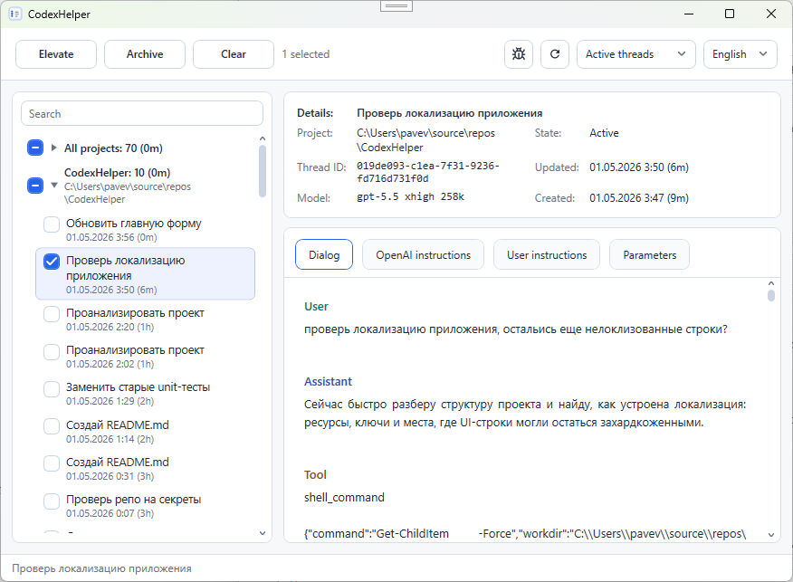
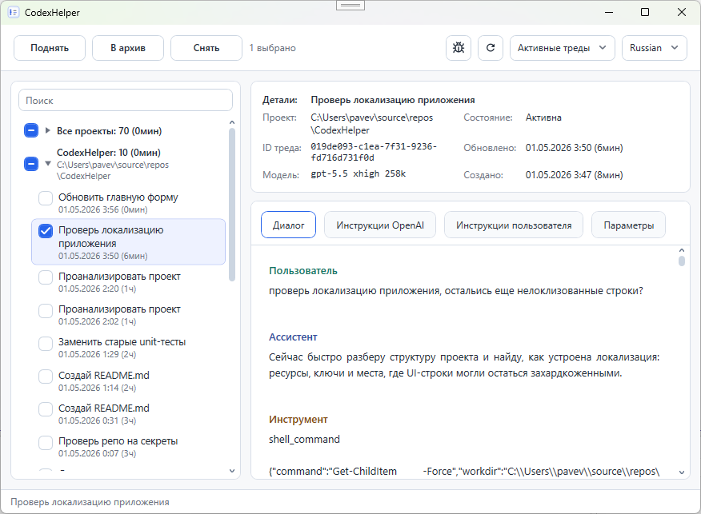

# CodexHelper

[English](#english) | [Русский](#русский)

## English

CodexHelper is a Windows desktop companion app for browsing, previewing, and managing local OpenAI Codex sessions.

It was created to work around a practical limitation in the Codex desktop app: the desktop client shows only the 50 most recent threads, and that limit is hardcoded in the client. Older threads still exist and can be accessed from the CLI, but they disappear from the desktop GUI. CodexHelper makes those older sessions visible again and can elevate selected threads by archiving and unarchiving them, which bumps them back into the Codex GUI.

It connects to the local `codex app-server`, reads Codex rollout files, and presents sessions in a project-oriented WPF interface so you can quickly find conversations, inspect details, and move sessions between active and archived states.



## Features

- Browse active and archived Codex sessions grouped by project.
- Search sessions by name, ID, project path, or project name.
- Preview conversation messages, model information, timestamps, and session state.
- Inspect captured OpenAI/developer instructions, user instructions, and sanitized session parameters.
- Archive selected sessions.
- Elevate selected sessions by archiving and restoring them so they reappear in Codex.
- Automatically refresh when Codex session files change.
- Fall back to read-only rollout-file browsing when `codex app-server` is unavailable.
- Switch the UI language between English and Russian.

## Requirements

- Windows.
- Visual Studio 2026, or the .NET 10 SDK with Windows Desktop support.
- OpenAI Codex CLI installed and available on `PATH` as `codex`.
- Existing Codex session data under `%USERPROFILE%\.codex`.

The app targets `net10.0-windows` and uses WPF, so it is Windows-only.
Archive and elevate actions require a Codex CLI version with `codex app-server` support. Without it, CodexHelper can still browse local rollout files in read-only mode.

## Installing Codex CLI

CodexHelper launches the Codex CLI from Windows, so install it in your Windows environment and make sure `codex` is available from a new terminal.

Install Node.js LTS from [nodejs.org](https://nodejs.org/) if `npm` is not installed yet, then install Codex CLI:

```powershell
npm install -g @openai/codex
```

Open a new PowerShell window and verify the command is available:

```powershell
codex --version
codex app-server --help
```

If `codex` is not found, check that npm's global package directory is on your Windows `PATH`, then reopen the terminal. To authenticate Codex, run `codex` once and sign in with ChatGPT, or configure an OpenAI API key as described in the official Codex documentation.

## Getting Started

Clone the repository:

```powershell
git clone https://github.com/gogijan/CodexHelper.git
cd CodexHelper
```

Restore and build:

```powershell
dotnet restore .\CodexHelper.slnx
dotnet build .\CodexHelper.slnx -c Release
```

Run from the command line:

```powershell
dotnet run --project .\CodexHelper\CodexHelper.csproj
```

Or open `CodexHelper.slnx` in Visual Studio 2026 and start the `CodexHelper` project.

Publish the small single-file win-x64 build that requires the .NET 10 Desktop Runtime on the target machine:

```powershell
dotnet publish .\CodexHelper\CodexHelper.csproj -p:PublishProfile=win-x64-singlefile-framework
```

The framework-dependent executable is written to `artifacts\publish\win-x64-singlefile-framework`. This is the smallest build, but users must install the .NET 10 Desktop Runtime x64.

## Release Process

Releases are built by GitHub Actions from version tags. The release workflow runs restore, build, tests, publish, packages a Windows x64 zip, uploads a SHA-256 checksum, and generates GitHub artifact attestations.

Before publishing the first release, enable immutable releases in the GitHub repository settings:

```text
Settings -> Releases -> Enable release immutability
```

To publish a release:

```powershell
git switch master
git pull
git tag -a v0.1.0 -m "v0.1.0"
git push origin v0.1.0
```

Use `git tag -s` instead of `git tag -a` if tag signing is configured locally. After the tag is pushed, the `Release` workflow creates the GitHub Release and attaches `CodexHelper-vX.Y.Z-win-x64.zip` plus its checksum.

## How It Works

CodexHelper starts `codex app-server --listen stdio://` as a child process and uses it to list, read, archive, and unarchive Codex threads.

For richer session details, it also reads local rollout files from:

- `%USERPROFILE%\.codex\sessions`
- `%USERPROFILE%\.codex\archived_sessions`

When possible, the app combines app-server thread data with rollout metadata such as model settings, reasoning effort, context window information, and token-count events. Instruction fields are shown separately, and instruction-like fields are removed from the parameter JSON preview.

## Local Data

CodexHelper stores only its own UI preferences, such as language and window layout, in:

```text
%LOCALAPPDATA%\CodexHelper\settings.json
```

Codex session content remains in the existing Codex storage locations. The app does not create its own copy of conversations.
CodexHelper itself only reads local Codex data and talks to the local Codex CLI app-server process.

## Project Structure

```text
CodexHelper/
  Assets/          Application icon resources
  Infrastructure/  MVVM helpers, commands, and converters
  Models/          Session, settings, and message models
  Rendering/       FlowDocument rendering for conversation previews
  Services/        Codex app-server client, rollout reader, localization, settings
  ViewModels/      Main window and tree view models
```

## Development Notes

- The solution file is `CodexHelper.slnx`.
- The main project is `CodexHelper/CodexHelper.csproj`.
- The publish profile is in `CodexHelper/Properties/PublishProfiles`.
- CI is defined in `.github/workflows/ci.yml` and validates restore, build, unit tests, and the small single-file publish profile.
- Release automation is defined in `.github/workflows/release.yml` and runs when a `vX.Y.Z` tag is pushed.
- Backend unit tests live in `CodexHelper.Tests` and can be run with `dotnet test .\CodexHelper.Tests\CodexHelper.Tests.csproj -c Release`.

## License

CodexHelper is licensed under the MIT License. See [LICENSE](LICENSE) for details.

## Русский

CodexHelper - это настольное приложение для Windows, которое помогает просматривать, искать и управлять локальными сессиями OpenAI Codex.

Оно было создано как практический обход ограничения в десктопном Codex: клиент показывает только 50 последних тредов, и это число захардкожено в самом клиенте. Старые треды при этом никуда не пропадают и остаются доступны через CLI, но в десктопном GUI их уже не видно. CodexHelper снова делает такие сессии видимыми и умеет поднимать выбранные треды через архивацию и деархивацию, после чего они возвращаются в GUI Codex.

Приложение подключается к локальному `codex app-server`, читает rollout-файлы Codex и показывает сессии в WPF-интерфейсе, сгруппированном по проектам. Это удобно, когда нужно быстро найти диалог, посмотреть детали сессии или перенести сессии между активным списком и архивом.



## Возможности

- Просмотр активных и архивных сессий Codex с группировкой по проектам.
- Поиск сессий по названию, ID, пути проекта или имени проекта.
- Предпросмотр сообщений диалога, информации о модели, временных меток и состояния сессии.
- Просмотр найденных OpenAI/developer instructions, пользовательских инструкций и очищенных параметров сессии.
- Архивация выбранных сессий.
- Поднятие выбранных сессий через архивирование и восстановление, чтобы они снова появились в Codex.
- Автоматическое обновление при изменении файлов сессий Codex.
- Резервный режим чтения rollout-файлов, если `codex app-server` недоступен.
- Переключение языка интерфейса между английским и русским.

## Требования

- Windows.
- Visual Studio 2026 или .NET 10 SDK с поддержкой Windows Desktop.
- OpenAI Codex CLI, установленный и доступный в `PATH` как `codex`.
- Существующие данные сессий Codex в `%USERPROFILE%\.codex`.

Приложение нацелено на `net10.0-windows` и использует WPF, поэтому работает только на Windows.
Архивация и поднятие требуют версию Codex CLI с поддержкой `codex app-server`. Без нее CodexHelper все равно может просматривать локальные rollout-файлы в режиме только чтения.

## Установка Codex CLI

CodexHelper запускает Codex CLI из Windows, поэтому установи его именно в Windows-окружении и проверь, что `codex` доступен из нового терминала.

Если `npm` еще не установлен, установи Node.js LTS с [nodejs.org](https://nodejs.org/), затем установи Codex CLI:

```powershell
npm install -g @openai/codex
```

Открой новое окно PowerShell и проверь, что команда доступна:

```powershell
codex --version
codex app-server --help
```

Если `codex` не найден, проверь, что глобальная папка npm добавлена в Windows `PATH`, затем снова открой терминал. Для авторизации Codex один раз запусти `codex` и войди через ChatGPT или настрой OpenAI API key по официальной документации Codex.

## Быстрый старт

Клонируй репозиторий:

```powershell
git clone https://github.com/gogijan/CodexHelper.git
cd CodexHelper
```

Восстанови зависимости и собери проект:

```powershell
dotnet restore .\CodexHelper.slnx
dotnet build .\CodexHelper.slnx -c Release
```

Запусти из командной строки:

```powershell
dotnet run --project .\CodexHelper\CodexHelper.csproj
```

Или открой `CodexHelper.slnx` в Visual Studio 2026 и запусти проект `CodexHelper`.

Опубликуй меньшую single-file win-x64 сборку, которая требует установленный .NET 10 Desktop Runtime на целевой машине:

```powershell
dotnet publish .\CodexHelper\CodexHelper.csproj -p:PublishProfile=win-x64-singlefile-framework
```

Framework-dependent exe будет в `artifacts\publish\win-x64-singlefile-framework`. Это самый маленький вариант, но пользователю нужен .NET 10 Desktop Runtime x64.

## Процесс релиза

Релизы собираются GitHub Actions из версионных тегов. Release workflow запускает restore, build, tests, publish, упаковывает Windows x64 zip, загружает SHA-256 checksum и создает GitHub artifact attestations.

Перед первым релизом включи immutable releases в настройках репозитория GitHub:

```text
Settings -> Releases -> Enable release immutability
```

Чтобы опубликовать релиз:

```powershell
git switch master
git pull
git tag -a v0.1.0 -m "v0.1.0"
git push origin v0.1.0
```

Если у тебя локально настроена подпись тегов, используй `git tag -s` вместо `git tag -a`. После push тега workflow `Release` создаст GitHub Release и приложит `CodexHelper-vX.Y.Z-win-x64.zip` вместе с checksum.

## Как это работает

CodexHelper запускает `codex app-server --listen stdio://` как дочерний процесс и использует его для получения списка thread-ов Codex, чтения данных, архивации и восстановления сессий.

Для более подробной информации о сессии приложение также читает локальные rollout-файлы из:

- `%USERPROFILE%\.codex\sessions`
- `%USERPROFILE%\.codex\archived_sessions`

Когда это возможно, приложение объединяет данные из app-server с метаданными rollout-файлов: настройками модели, reasoning effort, размером контекстного окна и событиями token count. Инструкции показываются отдельно, а поля, похожие на инструкции, удаляются из JSON-предпросмотра параметров.

## Локальные данные

CodexHelper хранит только собственные настройки интерфейса, например язык и размеры окна, здесь:

```text
%LOCALAPPDATA%\CodexHelper\settings.json
```

Содержимое сессий Codex остается в стандартных папках Codex. Приложение не создает отдельную копию диалогов.
Сам CodexHelper только читает локальные данные Codex и общается с локальным процессом Codex CLI app-server.

## Структура проекта

```text
CodexHelper/
  Assets/          Ресурсы иконки приложения
  Infrastructure/  MVVM-хелперы, команды и конвертеры
  Models/          Модели сессий, настроек и сообщений
  Rendering/       Рендеринг предпросмотра диалога через FlowDocument
  Services/        Клиент Codex app-server, чтение rollout-файлов, локализация, настройки
  ViewModels/      ViewModel главного окна и дерева проектов
```

## Заметки для разработки

- Файл решения: `CodexHelper.slnx`.
- Основной проект: `CodexHelper/CodexHelper.csproj`.
- Publish profile находится в `CodexHelper/Properties/PublishProfiles`.
- CI описан в `.github/workflows/ci.yml` и проверяет restore, build, unit tests и маленький single-file publish profile.
- Release automation описан в `.github/workflows/release.yml` и запускается при push тега `vX.Y.Z`.
- Backend unit tests находятся в `CodexHelper.Tests` и запускаются командой `dotnet test .\CodexHelper.Tests\CodexHelper.Tests.csproj -c Release`.

## Лицензия

CodexHelper распространяется по лицензии MIT. Подробности смотри в файле [LICENSE](LICENSE).
